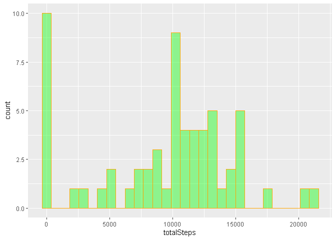
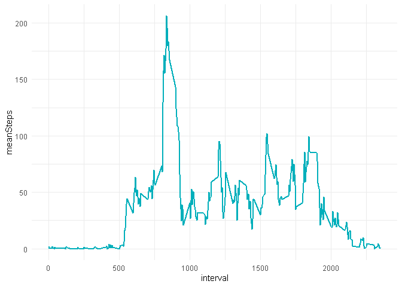
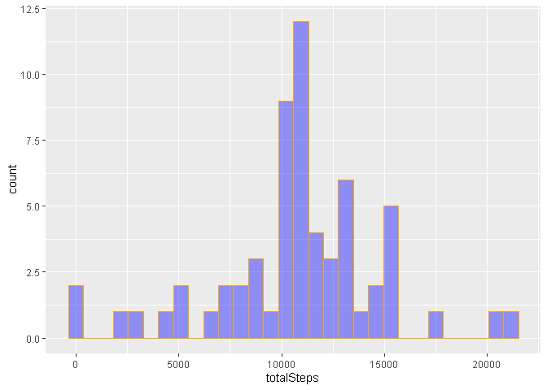
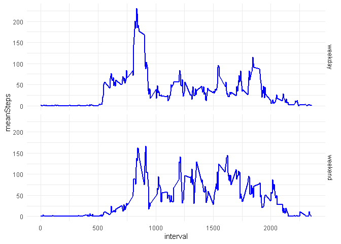

```r
        library(dplyr)
```

```
## 
## Attaching package: 'dplyr'
```

```
## The following objects are masked from 'package:stats':
## 
##     filter, lag
```

```
## The following objects are masked from 'package:base':
## 
##     intersect, setdiff, setequal, union
```

```r
        library(ggplot2)
```


## Loading and preprocessing the data

```r
        df <- read.csv("activity.csv", header=TRUE, sep=",", na.strings = "NA")
        dim(df)
```

```
## [1] 17568     3
```

```r
        str(df)
```

```
## 'data.frame':	17568 obs. of  3 variables:
##  $ steps   : int  NA NA NA NA NA NA NA NA NA NA ...
##  $ date    : Factor w/ 61 levels "2012-10-01","2012-10-02",..: 1 1 1 1 1 1 1 1 1 1 ...
##  $ interval: int  0 5 10 15 20 25 30 35 40 45 ...
```

```r
        df$dateOK <- as.Date(df$date, "%Y-%m-%d")
        head(df)
```

```
##   steps       date interval     dateOK
## 1    NA 2012-10-01        0 2012-10-01
## 2    NA 2012-10-01        5 2012-10-01
## 3    NA 2012-10-01       10 2012-10-01
## 4    NA 2012-10-01       15 2012-10-01
## 5    NA 2012-10-01       20 2012-10-01
## 6    NA 2012-10-01       25 2012-10-01
```

##1. What is mean total number of steps taken per day?

```r
#1.1 Calculate the total number of steps taken per day
        dfPerDay <- df %>% group_by(dateOK) %>% summarise(totalSteps = sum(steps, na.rm = TRUE))  
        head(dfPerDay)
```

```
## # A tibble: 6 x 2
##   dateOK     totalSteps
##   <date>          <int>
## 1 2012-10-01          0
## 2 2012-10-02        126
## 3 2012-10-03      11352
## 4 2012-10-04      12116
## 5 2012-10-05      13294
## 6 2012-10-06      15420
```

```r
#1.2 Make a histogram of the total number of steps taken each day
        ggplot(dfPerDay, aes(x=totalSteps)) + 
                geom_histogram(bins = 30, position="identity", alpha=0.4, col="orange", fill="green")
```

<!-- -->

```r
#1.3 Calculate and report the mean and median of the total number of steps taken per day
        #total mean
        mean(dfPerDay$totalSteps)
```

```
## [1] 9354.23
```

```r
        #total median
        median(dfPerDay$totalSteps)
```

```
## [1] 10395
```

```r
        #mean per day
        dfMeanPerDay <- df %>% group_by(dateOK) %>% summarise(meanSteps = mean(steps, na.rm = TRUE))  
        head(dfMeanPerDay)
```

```
## # A tibble: 6 x 2
##   dateOK     meanSteps
##   <date>         <dbl>
## 1 2012-10-01   NaN    
## 2 2012-10-02     0.438
## 3 2012-10-03    39.4  
## 4 2012-10-04    42.1  
## 5 2012-10-05    46.2  
## 6 2012-10-06    53.5
```

```r
        #median per day
        dfMedianPerDay <- df %>% group_by(dateOK) %>% summarise(meanSteps = median(steps, na.rm = TRUE))  
        head(dfMedianPerDay)
```

```
## # A tibble: 6 x 2
##   dateOK     meanSteps
##   <date>         <dbl>
## 1 2012-10-01        NA
## 2 2012-10-02         0
## 3 2012-10-03         0
## 4 2012-10-04         0
## 5 2012-10-05         0
## 6 2012-10-06         0
```

##2. What is the average daily activity pattern?

```r
#2.1  Make a time series plot (i.e. type="l") of the 5-minute interval (x-axis) and the average 
#number of steps taken, averaged across all days (y-axis)
        #calculate means per interval (across all days)
        dfPerInterval <- df %>% group_by(interval) %>% summarise(meanSteps = mean(steps, na.rm = TRUE))  
        head(dfPerInterval)
```

```
## # A tibble: 6 x 2
##   interval meanSteps
##      <int>     <dbl>
## 1        0    1.72  
## 2        5    0.340 
## 3       10    0.132 
## 4       15    0.151 
## 5       20    0.0755
## 6       25    2.09
```

```r
        #plotting
        ggplot(dfPerInterval, aes(x=interval, y=meanSteps)) + 
                geom_line(color="#00AFBB", size=1) +
                theme_minimal()
```

<!-- -->

```r
#2.2 Which 5-minute interval, on average across all the days in the dataset, contains the maximum
#number of steps?        
        
        dfPerInterval[dfPerInterval$meanSteps == max(dfPerInterval$meanSteps),]
```

```
## # A tibble: 1 x 2
##   interval meanSteps
##      <int>     <dbl>
## 1      835      206.
```

##3. Imputing missing values

```r
#3.1 Calculate and report the total number of missing values in the dataset (i.e. the total number of rows with NAs)

        sapply(df, function(x) sum(is.na(x)))
```

```
##    steps     date interval   dateOK 
##     2304        0        0        0
```

```r
#3.2 Devise a strategy for filling in all of the missing values in the dataset. 
#The strategy does not need to be sophisticated. For example, you could use the mean/median for that day,
#or the mean for that 5-minute interval, etc.

#Strategy: using mean of the 5-minute interval to fill NAs occurrences
        
#3.3 Create a new dataset that is equal to the original dataset but with the missing data filled in.
        dfOK <- merge(df, dfPerInterval)
        dfOK <- dfOK %>% mutate(stepsOK = ifelse(is.na(steps),meanSteps,steps))                

#3.4 Make a histogram of the total number of steps taken each day and Calculate and report the mean 
#and median total number of steps taken per day. Do these values differ from the estimates from the first part
#of the assignment? What is the impact of imputing missing data on the estimates of the total daily number of steps?
        #prepare data
        dfPerDayOK <- dfOK %>% group_by(dateOK) %>% summarise(totalSteps = sum(stepsOK))  
        head(dfPerDayOK)
```

```
## # A tibble: 6 x 2
##   dateOK     totalSteps
##   <date>          <dbl>
## 1 2012-10-01     10766.
## 2 2012-10-02       126 
## 3 2012-10-03     11352 
## 4 2012-10-04     12116 
## 5 2012-10-05     13294 
## 6 2012-10-06     15420
```

```r
        #Making a histogram 
        ggplot(dfPerDayOK, aes(x=totalSteps)) + 
                geom_histogram(bins = 30, position="identity", alpha=0.4, col="orange", fill="blue")
```

<!-- -->

```r
        #Calculating mean and median total
        mean(dfPerDayOK$totalSteps)
```

```
## [1] 10766.19
```

```r
        median(dfPerDayOK$totalSteps)
```

```
## [1] 10766.19
```

```r
        #Calculating mean and median per day
        dfMeanPerDayOK <- dfOK %>% group_by(dateOK) %>% summarise(meanSteps = mean(stepsOK))  
        head(dfMeanPerDayOK)
```

```
## # A tibble: 6 x 2
##   dateOK     meanSteps
##   <date>         <dbl>
## 1 2012-10-01    37.4  
## 2 2012-10-02     0.438
## 3 2012-10-03    39.4  
## 4 2012-10-04    42.1  
## 5 2012-10-05    46.2  
## 6 2012-10-06    53.5
```

```r
        #median per day
        dfMedianPerDayOK <- dfOK %>% group_by(dateOK) %>% summarise(medianSteps = median(stepsOK))  
        head(dfMedianPerDayOK)
```

```
## # A tibble: 6 x 2
##   dateOK     medianSteps
##   <date>           <dbl>
## 1 2012-10-01        34.1
## 2 2012-10-02         0  
## 3 2012-10-03         0  
## 4 2012-10-04         0  
## 5 2012-10-05         0  
## 6 2012-10-06         0
```

## Are there differences in activity patterns between weekdays and weekends?

```r
#4.1 Create a new factor variable in the dataset with two levels – “weekday” and “weekend” 
#indicating whether a given date is a weekday or weekend day.
        #instead of using weekdays function I prefer use as.POSIXlt()$wday construction
        dfOK <- dfOK %>% mutate(daytype = ifelse(as.POSIXlt(dfOK$dateOK)$wday==0,"weekend",ifelse(as.POSIXlt(dfOK$dateOK)$wday==6,"weekend","weekday")))                       
        
#4.2 Make a panel plot containing a time series plot (i.e.type="l") of the 5-minute interval 
#(x-axis) and the average number of steps taken, averaged across all weekday days or weekend days (y-axis).        
        
        #calculate means per interval and per daytype 
        dfPerIntervalOK <- dfOK %>% group_by(interval,daytype) %>% summarise(meanSteps = mean(stepsOK, na.rm = TRUE))  
        head(dfPerIntervalOK)
```

```
## # A tibble: 6 x 3
## # Groups:   interval [3]
##   interval daytype meanSteps
##      <int> <chr>       <dbl>
## 1        0 weekday    2.25  
## 2        0 weekend    0.215 
## 3        5 weekday    0.445 
## 4        5 weekend    0.0425
## 5       10 weekday    0.173 
## 6       10 weekend    0.0165
```

```r
        #plotting
        ggplot(dfPerIntervalOK, aes(x=interval, y=meanSteps)) +
                facet_grid(daytype~.) +
                geom_line(color="blue", size=1) +
                theme_minimal()
```

<!-- -->


